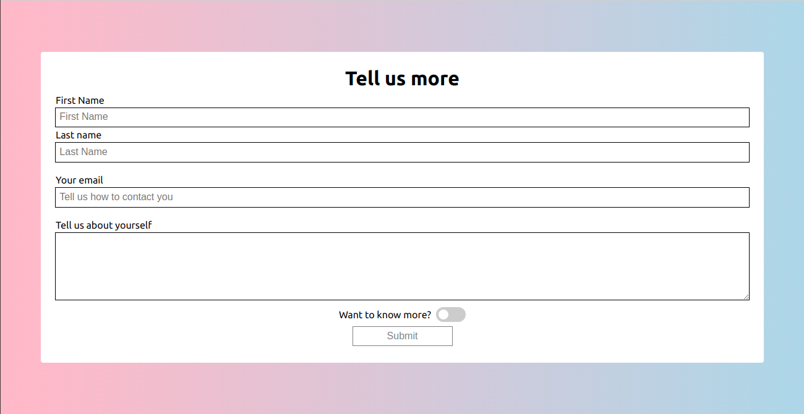

# Swagger - Responsive Form Project

The **Swagger Form Project** is designed to create a responsive and interactive form with custom styling and validation. This project demonstrates how to use HTML5 form elements, CSS for styling and focus effects, and basic client-side form validation. It also integrates with an external service for form submissions.

## Features

### Form Fields
- Four input fields:
  - **First Name** (text)
  - **Last Name** (text)
  - **Email** (email)
  - **Message** (textarea)
- A **toggle switch** styled checkbox.
- A **disabled submit button** that becomes enabled when the form is valid.

### Styling
- **Focus Effects**:
  - `hotpink` outline for text input fields when focused.
  - `blue` outline for the email field and the message (textarea) field when focused.
- Responsive design to ensure the form works seamlessly across devices.

### Validation
- **First Name, Last Name, Email**:
  - Minimum length required.
  - Fields are required for submission.
- **Message**:
  - Maximum length applied.
  - Required for submission.
- Submit button remains disabled until all fields are valid.

### Integration
- Form submissions are handled through **[Formspree.io](https://formspree.io)** for easy integration and processing.

## Example Previews
### Desktop Form


### Mobile View


## Technologies Used
- **HTML5**: For building the form structure.
- **CSS**: For styling the form, including responsive design and focus effects.
- **JavaScript (Optional)**: For enhancing validation or adding interactivity (if needed).

## Getting Started
1. Clone the repository to your local machine:
   ```bash
   git clone <repository-url>
